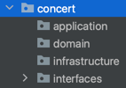

### 1. [마일스톤](https://github.com/users/seungwontech/projects/7)
### 2. [시퀀스 다이어그램](https://github.com/seungwontech/hhplus-concert-week3-5/blob/main/docs/%EC%8B%9C%ED%80%80%EC%8A%A4%EB%8B%A4%EC%9D%B4%EC%96%B4%EA%B7%B8%EB%9E%A8.md)
### 3. [ERD](https://github.com/seungwontech/hhplus-concert-week3-5/blob/main/docs/ERD.md)
### 4. [API](https://github.com/seungwontech/hhplus-concert-week3-5/blob/main/docs/API.md)
### 5. [Mock API](https://github.com/seungwontech/hhplus-concert-week3-5/blob/main/src/main/java/com/hhplus/tdd/concert/presentation/controller/ConcertController.java)

### 6. 패키지 구조

### 7. 주요 기술 스택
- java17
- Spring Boot 3.3.4
- Spring Data JPA 
- Gradle build
- MariaDB 11.3.2
