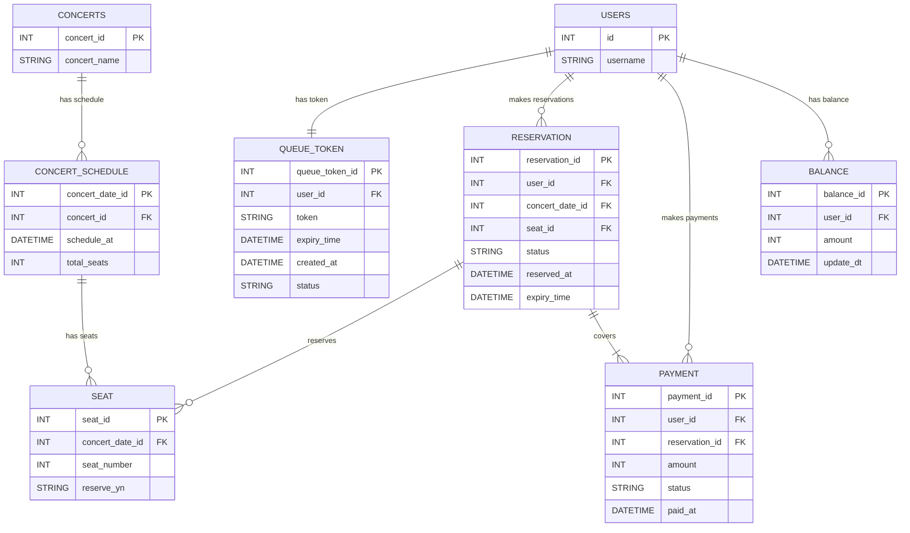

## 콘서트 예약 서비스 ERD

---

```mermaid
erDiagram
    USERS {
        INT id PK 
        STRING username 
    }

    CONCERTS {
        INT concert_id PK 
        STRING concert_name 
    }

    CONCERT_SCHEDULE {
        INT concert_date_id PK
        INT concert_id FK 
        DATETIME schedule_at
        INT total_seats
    }

    QUEUE_TOKEN {
        INT queue_token_id PK
        INT user_id FK
        STRING token 
        DATETIME expiry_time 
        DATETIME created_at
        STRING status
    }

    SEAT {
        INT seat_id PK 
        INT concert_date_id FK 
        INT seat_number 
        STRING reserve_yn
    }

    RESERVATION {
        INT reservation_id PK 
        INT user_id FK 
        INT concert_date_id FK 
        INT seat_id FK 
        STRING status
        DATETIME reserved_at 
        DATETIME expiry_time
    }

    PAYMENT {
        INT payment_id PK 
        INT user_id FK 
        INT reservation_id FK 
        INT amount 
        STRING status 
        DATETIME paid_at
    }

    BALANCE {
        INT balance_id PK 
        INT user_id FK 
        INT amount
        DATETIME update_dt
    }

    CONCERTS ||--o{ CONCERT_SCHEDULE : "has schedule"
    CONCERT_SCHEDULE ||--o{ SEAT : "has seats"
    USERS ||--|| QUEUE_TOKEN : "has token"
    USERS ||--o{ RESERVATION : "makes reservations"
    USERS ||--o{ PAYMENT : "makes payments"
    RESERVATION ||--o{ SEAT : "reserves"
    RESERVATION ||--|{ PAYMENT : "covers"
    USERS ||--o{ BALANCE : "has balance"

```