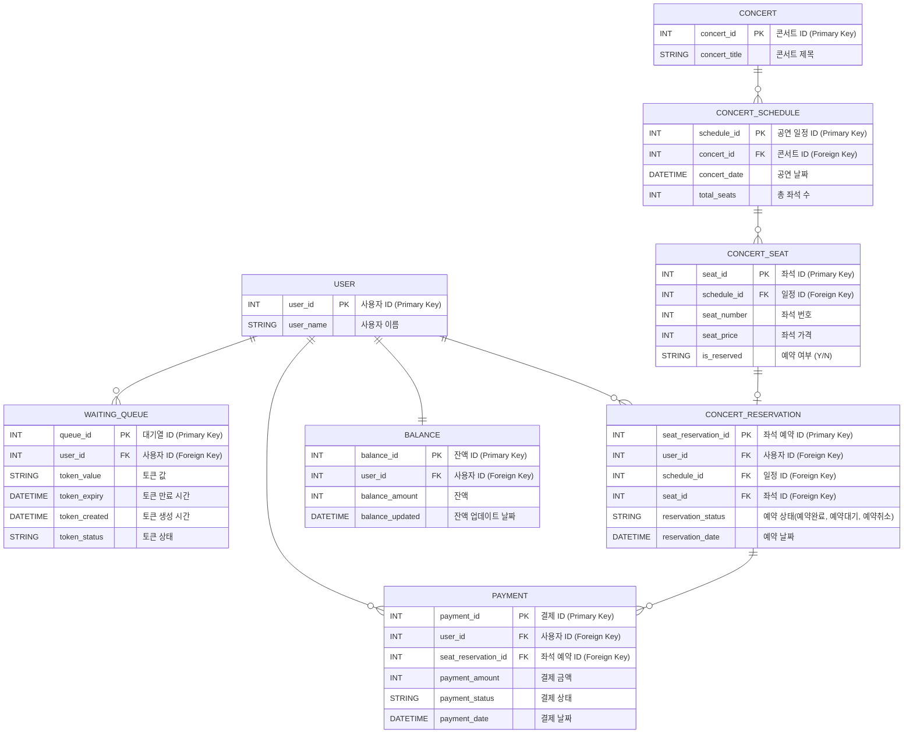

## 콘서트 예약 서비스 ERD

```mermaid
erDiagram
    USER {
        INT user_id PK "사용자 ID (Primary Key)"
        STRING user_name "사용자 이름"
    }

    WAITING_QUEUE {
        INT queue_id PK "대기열 ID (Primary Key)"
        INT user_id FK "사용자 ID (Foreign Key)"
        STRING token_value "토큰 값"
        DATETIME token_expiry "토큰 만료 시간"
        DATETIME token_created "토큰 생성 시간"
        STRING token_status "토큰 상태"
    }

    CONCERT {
        INT concert_id PK "콘서트 ID (Primary Key)"
        STRING concert_title "콘서트 제목"
    }

    CONCERT_SCHEDULE {
        INT schedule_id PK "공연 일정 ID (Primary Key)"
        INT concert_id FK "콘서트 ID (Foreign Key)"
        DATETIME concert_date "공연 날짜"
        INT total_seats "총 좌석 수"
    }

    CONCERT_SEAT {
        INT seat_id PK "좌석 ID (Primary Key)"
        INT schedule_id FK "일정 ID (Foreign Key)"
        INT seat_number "좌석 번호"
        INT seat_price "좌석 가격"
        STRING is_reserved "예약 여부 (Y/N)"
    }

    CONCERT_RESERVATION {
        INT seat_reservation_id PK "좌석 예약 ID (Primary Key)"
        INT user_id FK "사용자 ID (Foreign Key)"
        INT schedule_id FK "일정 ID (Foreign Key)"
        INT seat_id FK "좌석 ID (Foreign Key)"
        STRING reservation_status "예약 상태(예약완료, 예약대기, 예약취소)"
        DATETIME reservation_date "예약 날짜"
    }

    PAYMENT {
        INT payment_id PK "결제 ID (Primary Key)"
        INT user_id FK "사용자 ID (Foreign Key)"
        INT seat_reservation_id FK "좌석 예약 ID (Foreign Key)"
        INT payment_amount "결제 금액"
        STRING payment_status "결제 상태"
        DATETIME payment_date "결제 날짜"
    }

    BALANCE {
        INT balance_id PK "잔액 ID (Primary Key)"
        INT user_id FK "사용자 ID (Foreign Key)"
        INT balance_amount "잔액"
        DATETIME balance_updated "잔액 업데이트 날짜"
    }

    CONCERT ||--o{ CONCERT_SCHEDULE : ""
    CONCERT_SCHEDULE ||--o{ CONCERT_SEAT : ""
    USER ||--o{ CONCERT_RESERVATION : ""
    USER ||--o{ PAYMENT : ""
    USER ||--o{ WAITING_QUEUE : ""
    CONCERT_SEAT ||--o| CONCERT_RESERVATION : ""
    CONCERT_RESERVATION ||--o{ PAYMENT : ""
    USER ||--|| BALANCE : ""


```