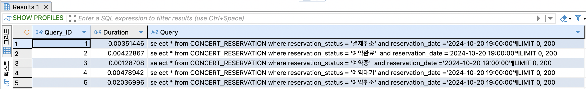

# 인덱스가 무엇인가?
> RDBMS에서 테이블에 대한 검색 속도를 높여주는 자료 구조를 말한다.  
> 테이블 내에 1개의 컬럼 혹은 여러 개의 컬럼을 이용하여 생성한다.  
> 특정 테이블의 컬럼을 인덱싱하면 검색을 할 때 테이블의 레코드를 전부 다 확인하는 것이  
> 아니라 인덱싱 되어 있는 자료 구조를 통해서 검색되기 때문에 검색 속도가 빨라진다.  
> 인덱스는 빠른 검색 속도 뿐만 아니라 레코드 접근에 대한 효율적인 순서 매김 동작에 대한 기초를 제공한다.

# 인덱스가 동작하는 원리
> 설정된 열을 검색할 때, 데이터베이스의 '옵티마이저'가 인덱스를 활용할지를 결정한다.  
> 옵티마이저는 가장 빠른 방법으로 SQL을 수행하기 위한 최적 경로를 찾는 엔진이다.
> 인덱스를 사용할 수 있다면 Full Table Scan을 피하고 인덱스를 통해 데이터를 검색하면   
> 검색 속도가 빨라지고 시스템 자원도 절약된다.

# 인덱스의 단점
> 검색 성능을 높이는 데 큰 도움이 되지만, 항상 정렬 상태를 유지해야 하므로 데이터 변경이 잦은 열에는 비효율적이다.  
> 특히 삽입, 수정, 삭제 시에는 인덱스를 갱신하는 추가 작업이 발생하여 속도가 저하된다
> 즉 조회에 주로 사용되는 열에 인덱스를 설정하는 것이 유리하다.

# 카디널리티
> 카디널리티는 특정 열에서 유니크한 값의 개수를 의미합니다. 검색 성능을 높이기 위해서는 카디널리티가 높은 열에 인덱스를 적용하는게 좋다.  
> 예를 들어 주민번호처럼 고유한 값이 많은 열은 카디널리티가 높고, 사용여부처럼 '사용/미사용'의 두 값만 있는 열은 카디널리티가 낮습니다.

# 요약
> 인덱스는 조회 성능을 크게 개선할 수 있지만, 데이터 변경이 잦은 열에는 비효율적이다.
> 카디널리티가 높은 열에 적용할 때 더 효과적이며, 옵티마이저는 인덱스를 활용하여 효율적인 검색을 수행하게 돕는다.

# 인기 있는 콘서트 목록 조회
> 콘서트에서 어떤 시나리오가 자주 조회하는 쿼리이면서 복잡할까 고민했습니다.  
> 하지만 기존에 있는 콘서트 예약 가능 날짜/좌석 조회는 자주 조회 되는 쿼리가 될 수 있지만 복잡한 쿼리라 생각 되지않았습니다.  
> 그래서 "인기있는 콘서트 목록 조회" 예상 시나리오를 만들어서 Step15를 해결해 보려고 합니다.

예약 테이블의 데이터: 2,800,000  
스케줄 테이블의 데이터 : 1,800  
콘서트 테이블의 데이터 : 4,000

## 쿼리프로파일링
> 쿼리가 수행 시 각 단계별로 작업 시간이 얼마나 걸리는지 확인 할수 있도록 MariaDB/MySQL에서 제공하는 기능입니다.  
> 쿼리 프로파일링은 MySQL 5.1부터 사용가능합니다.
## 테스트할 코드
```
ANALYZE select * from CONCERT_RESERVATION where reservation_status = '예약대기' and reservation_date ='2024-10-20 19:00:00';
ANALYZE select * from CONCERT_RESERVATION where reservation_status = '결제취소' and reservation_date ='2024-10-20 19:00:00';
ANALYZE select * from CONCERT_RESERVATION where reservation_status = '예약취소' and reservation_date ='2024-10-20 19:00:00';
ANALYZE select * from CONCERT_RESERVATION where reservation_status = '예약중'  and reservation_date ='2024-10-20 19:00:00';

CREATE INDEX idx_reservation_status_date ON hhplus.CONCERT_RESERVATION (reservation_status, reservation_date);
```

## 쿼리 속도 비교
- 인덱스 미 사용   
  
  
- 인덱스 사용
  
  
> 예약 대기 외 나머지는 속도가 향상된 것을 확인할수 있습니다.

## EXPLAIN와 ANALYZE
> EXPLAIN: 쿼리 실행 계획을 예측해서 보여줍니다. 실제 실행은 하지 않으며 예상되는 실행 방식과 인덱스 사용 등을 확인할 수 있습니다.  
> ANALYZE: 쿼리를 실제로 실행하고, 실제 실행 결과를 바탕으로 실제 실행 데이터를 제공합니다.
> r_rows: 실제 테이블에서 읽은 행의 수  
> r_filtered: where 조건을 적용 후 남은 행의 비율  
> - 즉 EXPLAIN은 예상 데이터를, ANALYZE는 실제 실행 데이터를 분석하는 차이가 있습니다.

## ANALYZE의 장점
> 실제 실행 데이터를 포함하여 EXPLAIN보다 정확한 성능 진단이 가능합니다.
> 인덱스를 사용할 경우, r_rows가 필요한 데이터만큼 줄어드며 성능 개선을 확인 할수 있습니다.

## ANALYZE 선택한 이유
> ANANLYZE는 EXPLAIN의 기능을 포함하면서, 쿼리의 실행 계획과 실제 실행 결과를 비교할수 있어 정확한 성능 분석을 제공하기 때문입니다.

## 예약중
### 인덱스 미적용

> 테이블의 데이터 수는 2,800,000이고 where조건에 맞는 데이터는 수는 50,100으로 다음과 같은 결과가 나왔습니다.  
> r_filtered: 50100/2800000 * 100 = 1.79%
### 인덱스 적용

> where 조건을 만족하는 데이터만 인덱스를 통해 직접 조회 했기 때문에 데이블의 데이터 수가 50,100로 조회되어 다음과 같은 결과가 나왔습니다.  
> r_filtered: 50100/50100 * 100 = 100%

## 예약 대기
### 인덱스 미적용

> 테이블의 데이터 수는 2,800,000이고 where조건에 맞는 데이터는 수는 1,236,675으로 다음과 같은 결과가 나왔습니다.  
> r_filtered: 1236675/2800000 * 100 = 44.17%
### 인덱스 적용

> where 조건을 만족하는 데이터만 인덱스를 통해 직접 조회 했기 때문에 데이블의 데이터 수가 1,236,675로 조회되어 다음과 같은 결과가 나왔습니다.  
> r_filtered: 1236675/1236675 * 100 = 100%

## 비교 분석중 궁금했던 내용
### 예약대기 속도
> 속도 분석했을 때 '예약대기'는 별 차이가 없었을까?  
> 아래 쿼리문으로 분석해보니 결과는 놀라왔습니다.  


> '예약대기' 데이터 값이 전체 데이터중 대략 44.17% 라는 높은 비중을 가지고 있기 때문에 인덱스가 있든 없든 별차이가 없었다.  

### 예약중 속도
> 위 퀴리 프로파일링으로 속도 분석했을 때 0.65에서 0.0012로 99% 향상 되었다. 이유는 다음과 같다.  
> '예약중' 은 인덱스를 사용했기 때문이다.
 

> 아래 인기있는 콘서트 목록 쿼리 프로파일링 속도 분석한 결과입니다.  
> 조회 속도가 75% 향상 했습니다.


## 인기 있는 콘서트 조회와 인덱스 SQL
```
SELECT 
    c.concert_title AS 콘서트명,
    cs.concert_date AS 공연일자,
    COUNT(cr.concert_reservation_id) AS 예약완료수
FROM 
    hhplus.CONCERT c
JOIN 
    hhplus.CONCERT_SCHEDULE cs ON c.concert_id = cs.concert_id
JOIN 
    hhplus.CONCERT_RESERVATION cr ON cs.concert_schedule_id = cr.concert_schedule_id
WHERE 
    cr.reservation_status = '예약중' and reservation_date ='2024-10-20 19:00:00'
GROUP BY 
    c.concert_id, cs.concert_date
ORDER BY 
    공연일자, 예약완료수 DESC
```
> CREATE INDEX idx_reservation_status_date ON hhplus.CONCERT_RESERVATION (reservation_status, reservation_date);