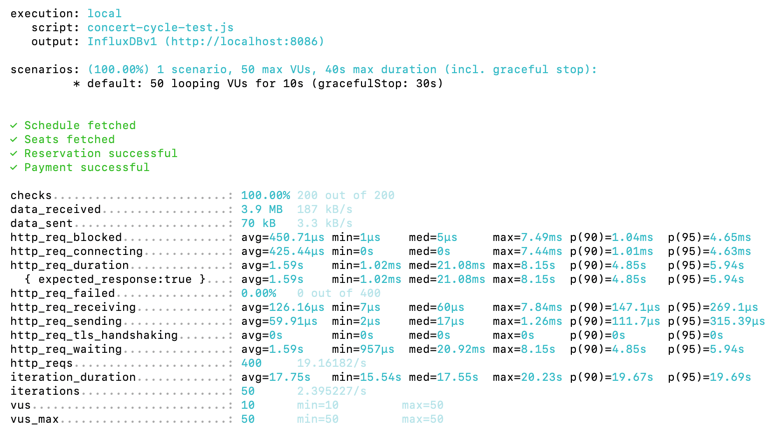

### 부하테스트
- 시스템, API 또는 애플리케이션이 동시 사용자 수나 요청의 증가로 인해 성능이 어떻게 변하는지 측정하는 테스트.
- 특정 부하에서 시스템의 응답 속도 측정.
- 시스템이 초당 처리 가능한 요청수 평가.
- 부하가 증가했을 때 시스템이 안정적으로 작동하는 지 확인.
- 성능 저하를 유발하는 코드, 데이터베이스 또는 서버 설정 확인.
> 부하 테스트의 결과는 병목 현상 제거와 성능 최적화의 중요한 기준점이 됨.

### k6
- JavaScript 기반의 오픈소스 부하 테스트 도구로 API, 웹 서비스, 또는 애플리케이션의 성능 테스트 목적으로 사용.
- 네이티브 Go로 작성되어 가볍고 빠른 성능 제공
- 테스트 시나리오를 JavaScript로 작성하여 유연한 제어 가능.
- 다양한 부하 시나리오 지원(예: 점진적 증가, 스파이크 테스트 등) 
- 부하테스트를 위해 클라우드 실행이나 InfluxDB/Grafana와의 통합을 지원.
> 성능 테스트 외에 병목 현상 분석에도 유용.

### Grafana 
- 성능 및 가동 시간 모니터링 등에 널리 사용됨.
- 다양한 플러그인과 대시보드를 통해 데이터를 효과적으로 분석 및 표시.
- InfluxDB, Prometheus 등과의 유연한 통합 지원.

### InfluxDB 
- 시계열 데이터에 특화된 데이터베이스로 주로 성능 모니터링 데이터 저장에 사용.
- 시간 기반 데이터 (요청 시간, 처리량) 저장에 최적화.
- K6와 기본적으로 연결 가능하며 Grafana와 함께 사용하여 성능 테스트 데이터의 시각화를 제공

### K6 + InfluxDB + Grafana 조합
> K6 → InfluxDB로 데이터 저장 → Grafana에서 데이터 시각화.
> 실시간 테스트 진행 상황을 확인하며 분석 가능.

### k6 lifeCycle
> k6 lifeCycle을 활용하여 setup() 함수에서 미리 테스트할 사용자의 대기열 토큰을 생성해놓고  
> default function() 함수로 토큰을 전달하여 이 함수에서는 오직 시나리오대로   
> API를 Dynamic하게 호출하였습니다.

### 1. 테스트 시나리오 선정
> Actor → 콘서트 날짜 조회 → 콘서트 좌석 조회 → 좌석 예약 → 결제

테스트 설정
 - 가상 사용자 VUs: 50명
 - 테스트 지속 시간: 10초
 - 추가로 30초의 gracefulStop 시간이 포함
  

http 요청 수|평균응답 시간| 최소응답 시간| 최대응답 시간| 중앙값(50%)| 상위 90%(p90)| 상위 95%(p95)| 요청 처리 속도|
---|---|---|---|---|---|---|---|
400|1.59s|1.02ms|8.15s|21.08ms|4.85s|5.94s|19.16s|

### 테스트 결과 분석
- HTTP 요청 수: 400건 
  > 400개의 요청이 처리되었습니다.

- 평균 응답 시간: 1.59초
  > 대부분의 요청은 빠르게 처리되었으나, 일부 요청에서 긴 응답 시간이 발생했습니다.

- 최소 응답 시간: 1.02ms
  > 가장 빠른 응답은 1.02ms로, 빠른 응답이 일부 있었습니다.

- 최대 응답 시간: 8.15초
  > 가장 긴 응답 시간은 8.15초로, 일부 요청에서 큰 지연이 발생했습니다.

- 중앙값(50%): 21.08ms
  > 전체 요청 중 절반은 21.08ms 이하로 처리되었습니다.

- 상위 90% 응답 시간(p90): 4.85초
  > 90%의 요청은 4.85초 이하로 처리되었습니다.

- 상위 95% 응답 시간(p95): 5.94초
  > 95%의 요청은 5.94초 이하로 처리되었습니다.

- 요청 처리 속도: 19.16 요청/초
  > 초당 약 19개의 요청을 처리했습니다.

### 종합 분석
- 대다수 요청은 빠르게 처리되었지만, 일부 요청에서 긴 응답 시간(최대 8.15초)이 발생했습니다.
- 성능 최적화를 위해 지연 원인을 분석하고, 리소스 확장이나 병목 해결이 필요합니다.

