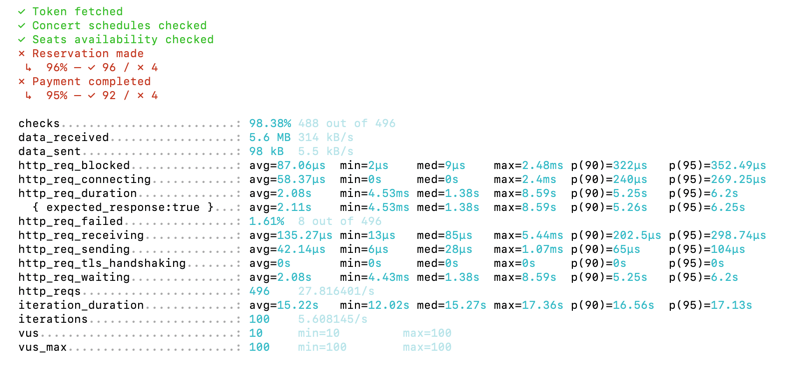
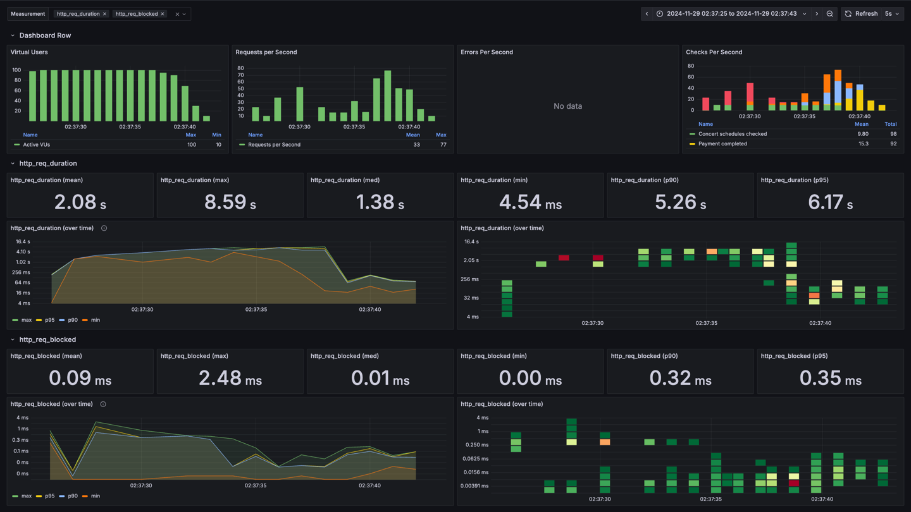

### 부하테스트
- 시스템, API 또는 애플리케이션이 동시 사용자 수나 요청의 증가로 인해 성능이 어떻게 변하는지 측정하는 테스트.
- 특정 부하에서 시스템의 응답 속도 측정.
- 시스템이 초당 처리 가능한 요청수 평가.
- 부하가 증가했을 때 시스템이 안정적으로 작동하는 지 확인.
- 성능 저하를 유발하는 코드, 데이터베이스 또는 서버 설정 확인.
> 부하 테스트의 결과는 병목 현상 제거와 성능 최적화의 중요한 기준점이 됨.

### k6
- JavaScript 기반의 오픈소스 부하 테스트 도구로 API, 웹 서비스, 또는 애플리케이션의 성능 테스트 목적으로 사용.
- 네이티브 Go로 작성되어 가볍고 빠른 성능 제공
- 테스트 시나리오를 JavaScript로 작성하여 유연한 제어 가능.
- 다양한 부하 시나리오 지원(예: 점진적 증가, 스파이크 테스트 등) 
- 부하테스트를 위해 클라우드 실행이나 InfluxDB/Grafana와의 통합을 지원.
> 성능 테스트 외에 병목 현상 분석에도 유용.

### Grafana 
- 성능 및 가동 시간 모니터링 등에 널리 사용됨.
- 다양한 플러그인과 대시보드를 통해 데이터를 효과적으로 분석 및 표시.
- InfluxDB, Prometheus 등과의 유연한 통합 지원.

### InfluxDB 
- 시계열 데이터에 특화된 데이터베이스로 주로 성능 모니터링 데이터 저장에 사용.
- 시간 기반 데이터 (요청 시간, 처리량) 저장에 최적화.
- K6와 기본적으로 연결 가능하며 Grafana와 함께 사용하여 성능 테스트 데이터의 시각화를 제공

### K6 + InfluxDB + Grafana 조합
> K6 → InfluxDB로 데이터 저장 → Grafana에서 데이터 시각화.
> 실시간 테스트 진행 상황을 확인하며 분석 가능.

### k6 lifeCycle
> k6 lifeCycle을 활용하여 setup() 함수에서 미리 테스트할 사용자의 대기열 토큰을 생성해놓고  
> default function() 함수로 토큰을 전달하여 이 함수에서는 오직 시나리오대로   
> API를 Dynamic하게 호출하였습니다.

### 1. 테스트 시나리오 선정
> Actor → 토큰 조회 → 콘서트 날짜 조회 → 콘서트 좌석 조회 → 좌석 예약 → 결제

```
import http from 'k6/http';
import { check, sleep } from 'k6';
import { SharedArray } from 'k6/data';

export const options = {
    scenarios: {
        load_test: {
            executor: 'ramping-vus',
            startVUs: 0,
            stages: [
                { duration: '1s', target: 100 },
                { duration: '3s', target: 100 },
                { duration: '1s', target: 0 },
            ],
        },
    },
};

const BASE_URL = 'http://localhost:8080/api/concerts';
const QUEUE_URL = 'http://localhost:8080/api/waiting-queue';

const users = new SharedArray('users', function () {
    return Array.from({ length: 1000 }, (_, i) => i + 1);
});

function fetchToken(userId) {
    const queueRes = http.get(`${QUEUE_URL}/position`, {
        headers: {
            'user-id': userId,
        },
    });

    check(queueRes, {
        'Token fetched': (r) => r.status === 200
    });

    const token = queueRes.json().token;
    if (!token) {
        console.error(`Failed to fetch token for user ${userId}`);
    }
    return token;
}

function fetchSchedule(concertId, token) {
    const scheduleRes = http.get(`${BASE_URL}/${concertId}/schedules`, {
        headers: { Token: token },
    });

    check(scheduleRes, {
        'Concert schedules checked': (r) => r.status === 200,
    });

    const schedules = scheduleRes.json().schedules;

    if (schedules.length === 0) {
        console.log('No available schedules for concert ' + concertId);
        return;
    }

    return schedules[0].concertScheduleId; // 첫 번째 날짜 ID 반환
}

function fetchSeats(concertId, scheduleId, token) {
    const seatsRes = http.get(`${BASE_URL}/${concertId}/schedules/${scheduleId}/seats`, {
        headers: { Token: token },
    });

    check(seatsRes, {'Seats availability checked': (r) => r.status === 200});

    const seats = seatsRes.json().seats.map((seat) => seat.concertSeatId);
    if (seats.length === 0) {
        console.log('No available seats for concert ' + concertId + ' and schedule ' + scheduleId);
        return;
    }

    return seats;
}

function makeReservation(concertId, scheduleId, concertSeatId, userId, token) {
    const reservationPayload = JSON.stringify({
        concertSeatIds: [concertSeatId],
        userId: userId,
    });

    const reservationRes = http.post(
        `${BASE_URL}/${concertId}/schedules/${scheduleId}/seats/reservation`,
        reservationPayload,
        {
            headers: {
                'Content-Type': 'application/json',
                Token: token,
            },
        }
    );

    check(reservationRes, {'Reservation made': (r) => r.status === 200});

    return reservationRes.json().concertReservationId;
}

function makePayment(concertId, scheduleId, reservationId, seatId, userId, token) {
    const paymentPayload = JSON.stringify({
        userId: userId,
        concertSeatIds: [seatId],
        concertReservationId: [reservationId],
    });

    const paymentRes = http.post(
        `${BASE_URL}/${concertId}/schedules/${scheduleId}/seats/reservation/payment`,
        paymentPayload,
        {
            headers: {
                'Content-Type': 'application/json',
                Token: token,
            },
        }
    );

    check(paymentRes, {'Payment completed': (r) => r.status === 200});

}

export default function () {
    const userId = users[Math.floor(Math.random() * users.length)];

    // Step 1: Fetch token
    const token = fetchToken(userId);

    if (!token) {
        console.error('Token fetching failed for user ' + userId);
        return;
    }

    const concertId = 1;

    // Step 2: Fetch schedule
    const scheduleId = fetchSchedule(concertId, token);
    if (!scheduleId) {
        console.error('No schedule available for concert ' + concertId);
        return;
    }
    sleep(1);

    // Step 3: Fetch seats
    const seatIds = fetchSeats(concertId, scheduleId, token);
    if (!seatIds || seatIds.length === 0) {
        console.error('No seats available for concert ' + concertId + ' and schedule ' + scheduleId);
        return;
    }

    const seatIndex = Math.floor(Math.random() * seatIds.length);
    const seatId = seatIds[seatIndex];
    sleep(1);

    // Step 4: Make reservation
    const reservationId = makeReservation(concertId, scheduleId, seatId, userId, token);
    if (!reservationId) {
        console.error('Reservation failed for user ' + userId);
        return;
    }
    sleep(2);

    // Step 5: Make payment
    makePayment(concertId, scheduleId, reservationId, seatId, userId, token);
    sleep(1);
}

```




### 분석 결과
1. http 요청 수
    > 총 HTTP 요청 수: 496  
    요청 처리 속도: 27.82 요청/초 (초당 약 28개 요청)
    

2. 응답시간
   > 평균 응답 시간: 2.08초  
   최소 응답 시간: 4.53ms  
   최대 응답 시간: 8.59초  
   중앙값 (50%): 1.38초  
   상위 90% 응답 시간 (p90): 5.25초  
   상위 95% 응답 시간 (p95): 6.2초  

### 결론
> 성능: 시스템의 응답 시간이 다소 높고, 상위 90% 이상의 응답 시간이 긴 문제가 있다. 특히 95%의 응답 시간까지 길어지므로 전체적인 응답 시간 최적화가 필요하다.  
> 응답 시간: 응답 시간이 평균적으로 높고, 상위 90% 이상에서는 급격히 길어지는 경향이 있다. 이는 병목 지점이나 최적화가 필요한 코드 부분이 있을 수 있음을 의미한다.
> 안정성: 1.61%의 실패율은 상당히 적은 수치로 보일 수 있지만, 실패율이 증가하면 큰 문제가 될 수 있다. 시스템의 안정성 보강이 필요하다. 
> 사용자 경험: 긴 응답 시간과 실패율은 사용자 경험을 저하시킬 수 있습니다. 개선이 필요합니다.  
