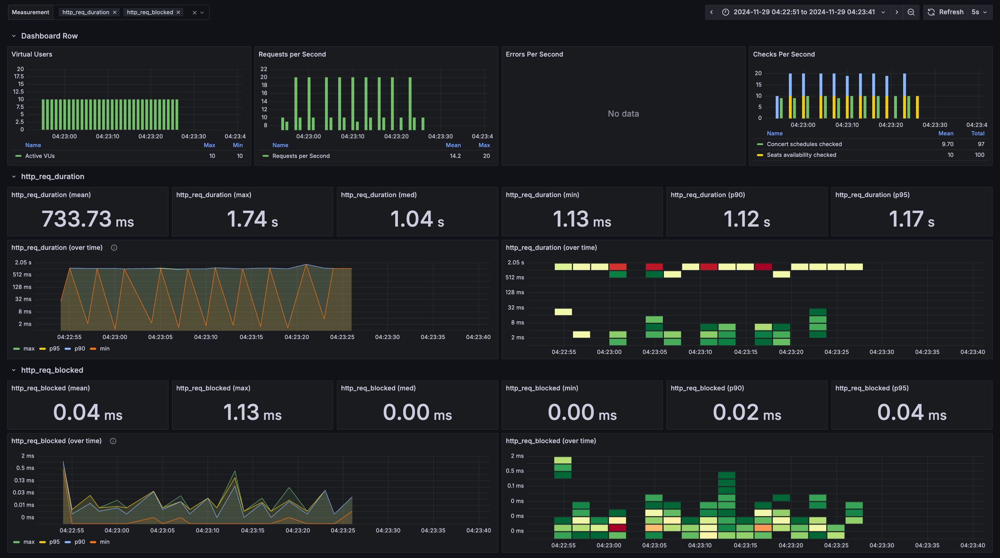

## 가상 장애 대응 방안에 관한 보고서

### 1. 개요
- 콘서트 예매 시스템의 부하 테스트 결과를 바탕으로, 발생 가능한 다양한 장애 상황과 그에 대한 대응 방안을 제시한다.
- 이를 통해 안정적인 서비스 운영이 가능하도록 필요한 전략과 개선 방향을 정리한다.

### 2. 가상 장애 대응 문서

#### 인기 콘서트의 좌석 정보 조회
상황
> 다수의 사용자들이 동시에 조회하는 상황

장애 발생 시나리오
> 인기 있는 콘서트 좌석 정보에 대한 조회 요청이 집중되어, 동시에 많은 사용자들이 동일한 데이터를 조회 하게됨  
> 이로 인해 데이터베이스 서버에 과부하가 발생하고 응답 시간이 급격히 증가하거나 데이터베이스가 다운되는 상황 발생

병목 구간
> 인기 콘서트 좌석 정보를 조회하는 쿼리가 동시에 여러 요청을 처리하려 할 때, 데이터베이스에 과도한 부하가 발생.  
> 적절한 인덱스가 없거나 기존 인덱스가 비효율적으로 설계되어 있으면 조회 속도가 급격히 저하될 수 있음.

개선 방향:  
> 콘서트 좌석 정보를 조회하는 쿼리에 자주 사용되는 조건에 대해 인덱스를 적용하여 조회 성능을 최적화한다.  
> 이를 통해 데이터 베이스가 빠르게 조회 작업을 처리할 수 있도록 도와줍니다.
> 인기 콘서트 좌석 정보 조회시 다수의 조건이 조합될 수 있습니다. 복합 인덱스를 사용하여 더 개선할수 있습니다.
> 자주 조회되는 인기 콘서트 좌석 정보를 캐싱하여 데이터베이스에 불필요한 요청이 반복되지 않도록 할수 있다.

결론 및 대응 방안
> 인기 콘서트의 좌석 정보를 조회하는 상황에서 발생할 수 있는 데이터베이스 부하 문제는 주로 인덱스 최적화와 쿼리 튜닝을  
> 통해 해결할 수 있습니다. 또한 캐싱 전략을 통해 데이터베이스의 응답 속도를 빠르게 유지할수 있습니다.

### 인덱스 적용

### 인덱스 미적용

#### 비교
1. 응답 시간
    - 인덱스 적용:
    >  http_req_duration: 평균 374.6ms, 최대 1.47s, p(90) 1.07s, p(95) 1.27s  
    > http_req_waiting: 평균 374.21ms  
   
   - 인덱스 미적용:
   > http_req_duration: 평균 736.41ms, 최대 1.74s, p(90) 1.12s, p(95) 1.16s   
   > http_req_waiting: 평균 735.91ms   
   
- 분석: 인덱스를 적용한 경우, 요청 처리 시간이 평균적으로 2배 정도 더 빠릅니다. http_req_duration과 http_req_waiting 모두 인덱스 적용 시 현저히 짧아진 것을 확인할 수 있습니다. 이는 데이터베이스 쿼리 성능 향상에 따른 결과로, 인덱스가 조회 성능을 크게 개선했음을 나타냅니다.

2. 전체 처리량
    - 인덱스 적용:
    > http_reqs: 450 요청, 초당 14.09 요청 처리  
    > iterations: 150, 초당 4.69 반복 처리  

    - 인덱스 미적용:
    > http_reqs: 300 요청, 초당 9.33 요청 처리  
    > iterations: 100, 초당 3.11 반복 처리  

- 분석: 인덱스 적용 시 초당 처리되는 요청 수와 반복 횟수가 모두 증가했습니다. 이는 인덱스가 쿼리 성능을 높여, 더 많은 요청을 더 빠르게 처리할 수 있게 도와주었음을 나타냅니다.

### 결론
> 성능 향상: 인덱스 적용 시, 평균 응답 시간이 약 50% 이상 단축되었으며, 처리량도 크게 향상되었습니다.  
> 자원 효율성: 인덱스 적용은 데이터베이스에 대한 부하를 줄여, 요청 차단 시간과 연결 시간을 감소시켰습니다.  
> 전체적인 효과: 전반적인 성능을 개선하고, 더 많은 요청을 동시에 처리할 수 있게 되었으며, 데이터 수신과 전송 효율도 향상되었습니다.  