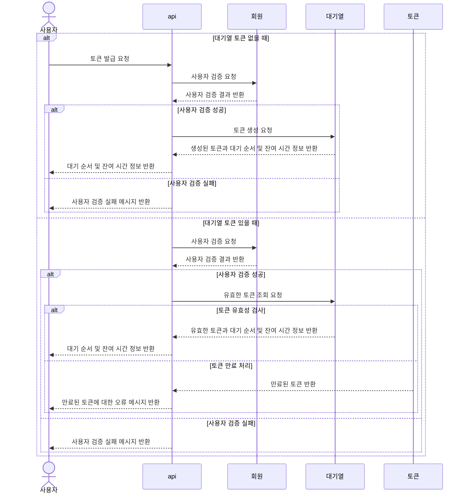
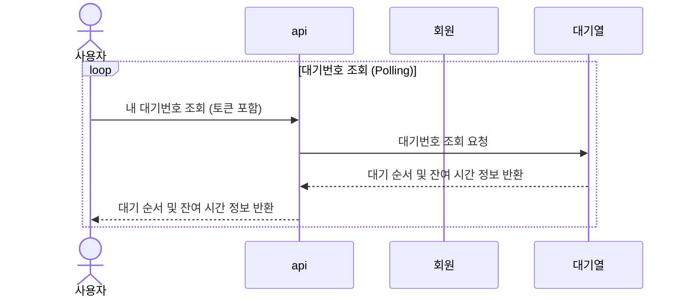
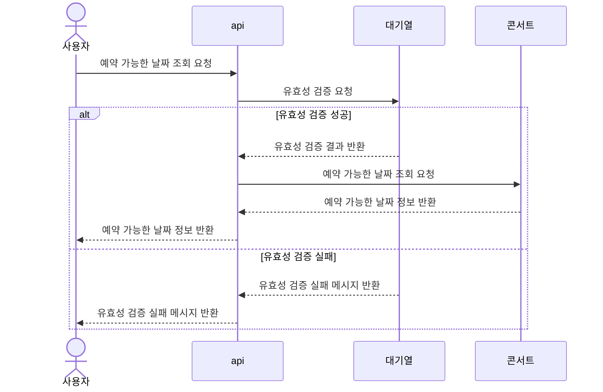
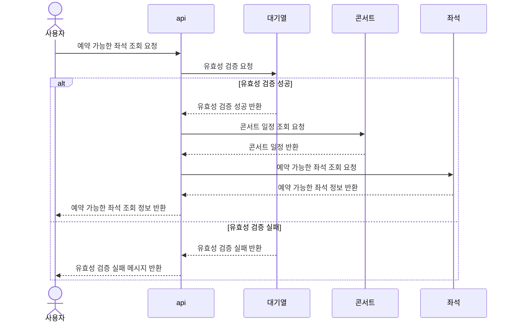
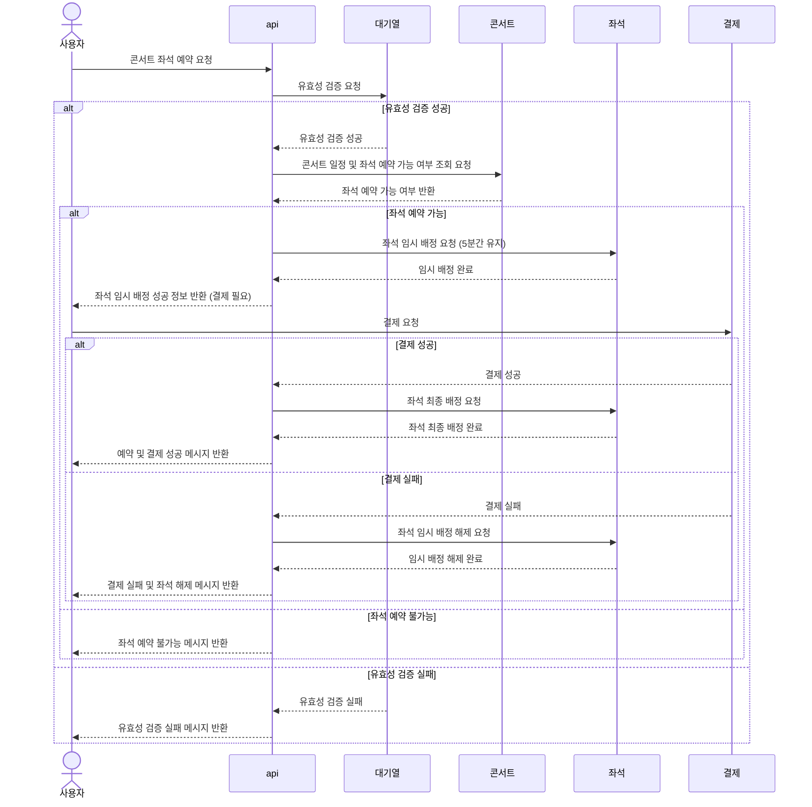
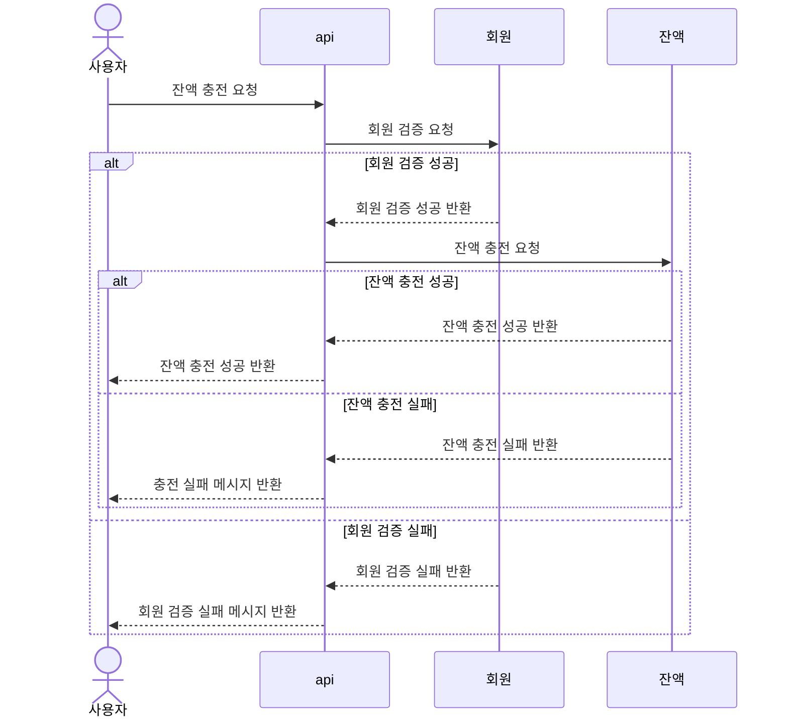
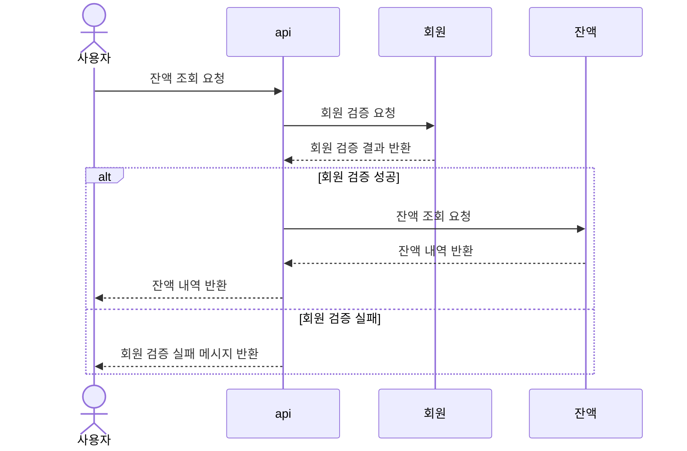
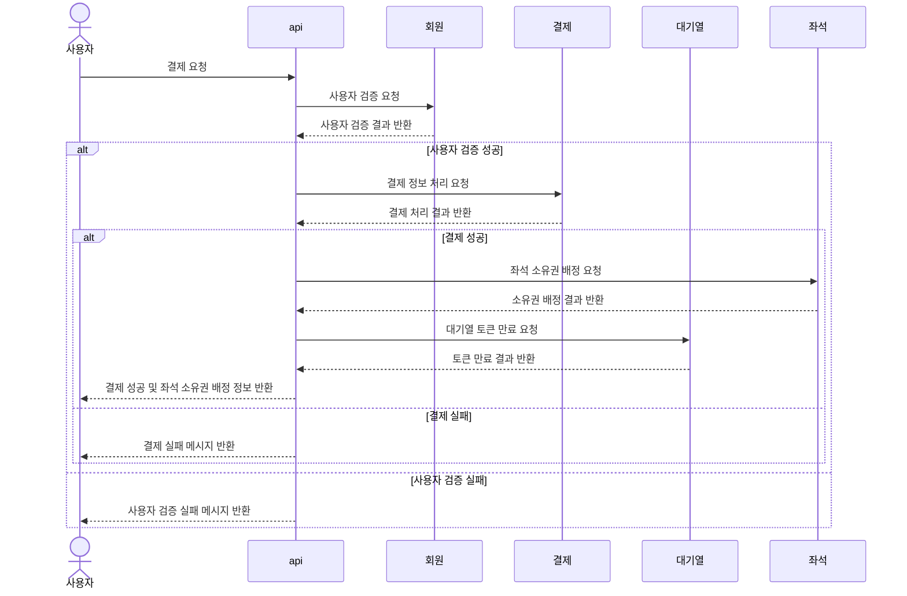

## 시퀀스 다이어그램

#### 유저 대기열 토큰 발급 API

---
#### 대기번호 조회 (Polling)

----
#### 예약 가능 날짜 API

---
#### 예약 가능 좌석 API

---
#### 좌석 예약 요청 API

---

#### 잔액 충전 API

---
#### 잔액 조회 API

---
#### 결제 API
